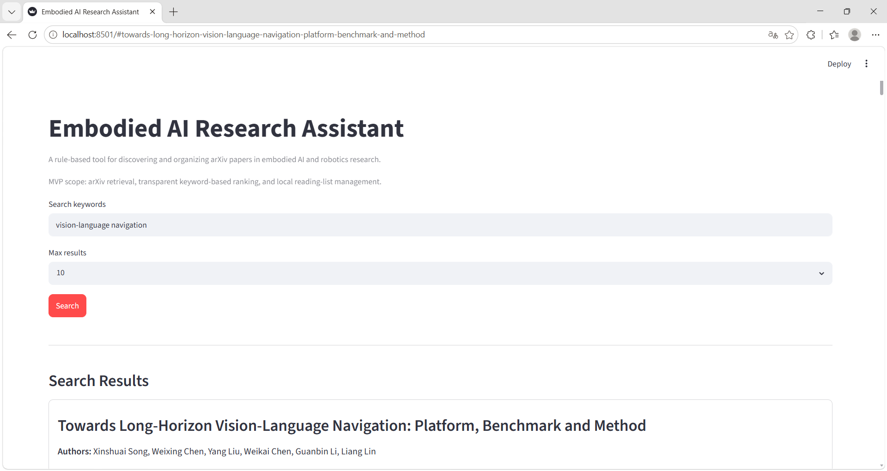
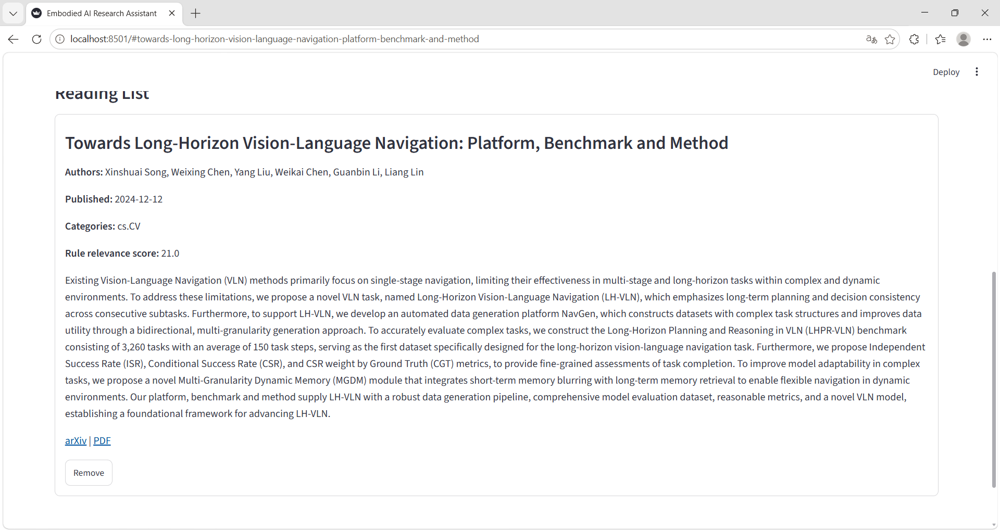

# Embodied AI Research Assistant

A small, rule-based research workflow assistant for discovering, ranking, and organizing arXiv papers in embodied AI, VLA, robotics, multimodal perception, robot navigation, and world model research.

This MVP focuses on transparent paper retrieval and local reading-list management. It does not include paid APIs, databases, Docker, vector search, or PDF parsing.

## MVP Features

- Search arXiv papers from a Streamlit interface.
- Display titles, authors, abstracts, publication dates, categories, arXiv links, and PDF links.
- Rank results with a transparent keyword-based scoring rule.
- Save papers to a local JSON reading list.
- Remove papers from the reading list.
- Run offline unit tests for ranking and local storage.

## Screenshots

Search workflow: retrieve and rank arXiv papers by transparent keyword rules.



Reading-list workflow: save, persist, and remove papers locally.



## Installation

Create a virtual environment:

```bash
python -m venv .venv
```

Activate it on Windows PowerShell:

```bash
.\.venv\Scripts\Activate.ps1
```

Activate it on macOS or Linux:

```bash
source .venv/bin/activate
```

Install dependencies:

```bash
pip install -r requirements.txt
```

## Run the App

```bash
streamlit run app.py
```

## Run Tests

```bash
python -m pytest -q
```

The tests are offline and do not call the arXiv network API.

## Project Structure

```text
embodied-ai-research-assistant/
|-- app.py
|-- README.md
|-- requirements.txt
|-- .gitignore
|-- data/
|   `-- reading_list.json
|-- docs/
|   `-- screenshots/
|       |-- search-results.png
|       `-- reading-list.png
|-- src/
|   `-- research_assistant/
|       |-- __init__.py
|       |-- arxiv_client.py
|       |-- ranking.py
|       |-- storage.py
|       |-- models.py
|       `-- config.py
`-- tests/
    |-- test_ranking.py
    `-- test_storage.py
```

## Transparency Notes

- Uses arXiv metadata retrieval.
- Uses rule-based keyword ranking.
- Uses a local JSON reading list.
- Current MVP does not include LLM-based summarization or autonomous agent planning.

The rule-based relevance score is intentionally simple:

- Full query phrase in the title: +6
- Each query keyword in the title: +3
- Full query phrase in the abstract: +3
- Each query keyword in the abstract: +1
- Ties are sorted by newer publication date first.

## Future Work

- Query expansion.
- Paper comparison table.
- BibTeX export.
- CSV export.
- Optional local or LLM-assisted summarization with clear provenance.
- Transparent research-planning workflow.